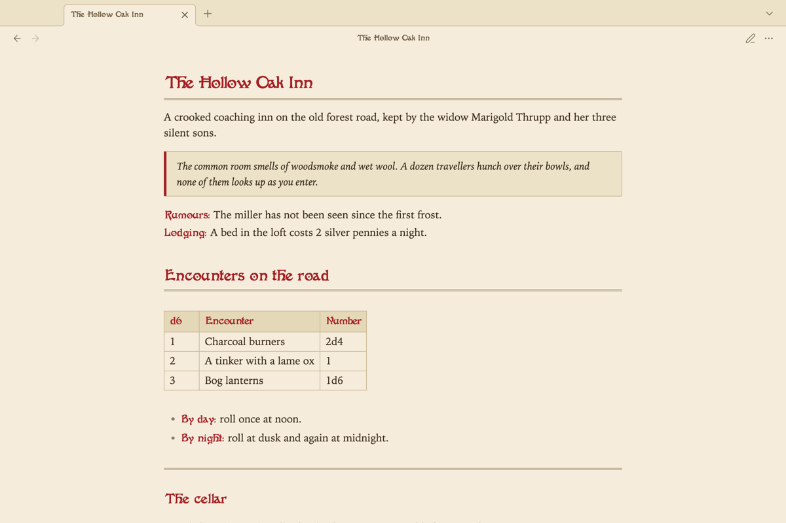
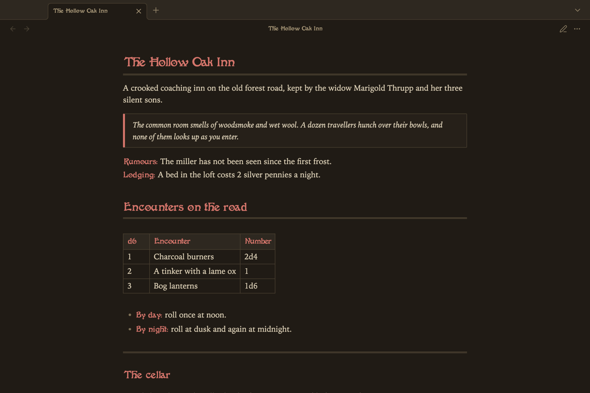

# Atlas VTT

A theme for [Obsidian](https://obsidian.md) that makes notes look like the pages of an old adventure module: parchment, red display headings, ruled tables and boxed read-aloud text. It is the companion theme of the [Atlas VTT](https://github.com/ByteMirror/atlas-vtt) plugin and works just as well without it.

## What your notes get

- A parchment light scheme and a warm, candle-lit dark scheme.
- Sidebars, menus, dialogs, buttons and input fields in the same tones, so Obsidian's settings and the panels of Atlas VTT belong to the page.
- Ivy on Atlas VTT's asset manager, statblock previews and command palette, the ivy of the Atlas sword. It grows nowhere else in Obsidian.
- In Atlas VTT's statblocks, creature names and section headings are set in the heading font, as is the name of a roll on the dice.
- Headings, file names, table headers and callout titles in Fantaisie Artistique. The font is part of the theme, so there is nothing to install.
- Note text in a book serif: Iowan Old Style, Palatino or Georgia, whichever your system has.
- A double rule under the note title, under first and second level headings, and for `---`.
- Block quotes as boxed text to read aloud at the table.
- Labels: bold text that opens a line, as in `**Lodging:** A bed in the loft costs 2 silver pennies`, is set in the heading font and in red.

The text font and the accent colour you choose under **Settings → Appearance** replace the theme's.

Cards drawn by the [Fantasy Statblocks](https://github.com/javalent/fantasy-statblocks) plugin keep the look of their own layout.

## Install

Open **Settings → Appearance**, select **Manage** next to **Themes**, search for "Atlas VTT" and select **Install and use**.

To install by hand, download `manifest.json` and `theme.css` from the [latest release](https://github.com/ByteMirror/atlas-vtt-theme/releases/latest) and put them in `.obsidian/themes/Atlas VTT/` inside your vault.

## Licences

The theme is released under the [MIT License](./LICENSE).

Fantaisie Artistique was digitised by George Williams and is embedded in `theme.css` under the [SIL Open Font License 1.1](./fonts/OFL.txt). The font file is in [`fonts/`](./fonts).
